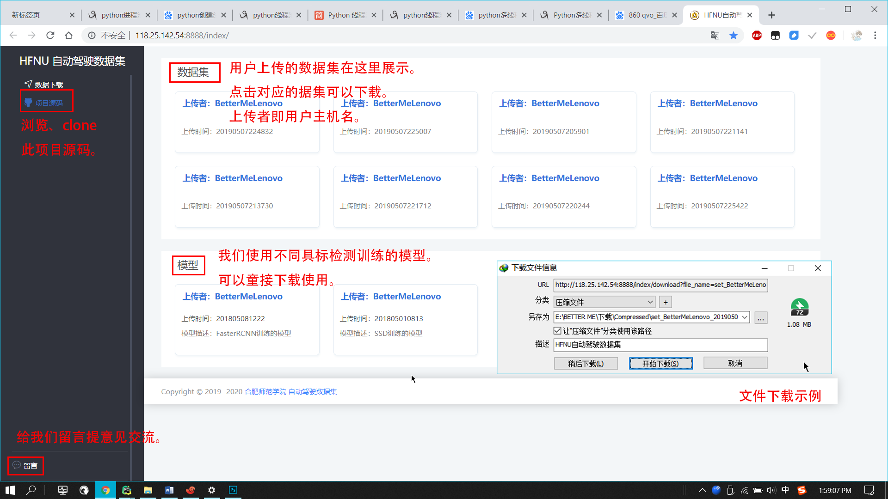

### 简介

这个项目是我用来参加2019届安徽省物联网比赛的，通过深度学习目标检测算法Faster_RCNN来检测树莓派小车摄像头拍的车道线、转向标记、交通信号灯、停车标记，并根据检测的结果的种类与位置来控制小车运动。对于小车对交通信号灯状态的识别，这里不是采用直接检测信号灯的方法，而是通过请求控制信号灯状态的服务器来获取信号灯状态。最后，还可以将每次检测的结果制作成训练目标检测模型所需的数据集并可将其上传至我们的服务器供下载。

### 实物图

用到了一个淘宝22.8的遥控小车，2个sg90舵机，2块锂电池，2块3A块升压板（一块专门给树莓派供电，一块给其他零件供电），一个树莓派3B和一块6612FNG。

当树莓派输出的控制后驱电机的PWM占空比比较低时，会后驱电机的驱动力不足的情况，改成步进电机的话，效果应该会更好。

### 运行流程

### 数据集、模型下载网站

### 测试轨道

### 目录结构

self_driving_base_on_object_detection:
│  .gitignore
│  client.py	
│  CNN_driver.py
│  CNN_driver_test.py
│  collect_data_pc.py
│  csv_to_tfRecord.py
│  detector_driver.py
│  detector_driver_test.py
│  environment_gpu.yml
│  object_detector.py
│  process_img.py
│  README.md
│  server.py
│  server_conf.conf
│  server_conf_2.conf
│  train.py
│  uploader.py
│  util.py
│          
├─bgr_data
│  ├─2019-05-06_22-22-03
│  │      0_image1557152598.117841.jpg
│  │      0_image1557152598.412826.jpg
│  │  
├─code_run_on_pi
│      car_control.py
│      collect_data_pi.py
│      
├─logs
│  └─tensorboard
│          events.out.tfevents.1555171733.BETTERMELENOVO
│          events.out.tfevents.1555172048.BETTERMELENOVO
│          
├─traffic_light_control
│      traffic_light_controlor.py
│      
├─upload_to_server
│  └─data_set
│      ├─set_BetterMeLenovo_20190509194323
│      │  │  log.txt
│      │  │  pet_label_map.pbtxt
│      │  │  set_BetterMeLenovo_20190509194323.csv
│      │  │  
│      │  └─images
│      │          image_0.jpg
│      │          image_1.jpg
│      │          image_2.jpg
│      │          image_3.jpg
│      │          image_4.jpg
│      │          image_5.jpg
│      │          image_6.jpg
│      │          image_7.jpg
│      │          image_8.jpg
│      │          image_9.jpg
│      │          image_99.jpg
│      │          
│      └─zip
│              set_BetterMeLenovo_20190516201657.zip
│              set_mdmbct_20190518130102.zip
│              
├─web
│  │  db.sqlite3
│  │  manage.py
│  │  
│  ├─self_driving_data_set
│  │      model.py
│  │      settings.py
│  │      urls.py
│  │      view.py
│  │      wsgi.py
│  │      __init__.py
│  │      
│  ├─static
│  │  ├─css
│  │  │      iconfont.css
│  │  │      style.css
│  │  │      style.less
│  │  │      
│  │  ├─img
│  │  │      favcion.ico
│  │  │      
│  │  ├─js
│  │  │      jquery.js
│  │  │      
│  │  └─source
│  │      ├─data_set
│  │      └─model
│  └─templates
│      │  hello.html
│      │  
│      └─self_driving_data_set
│              index.html
│              README.md
             

### 文件说明

bgr_data：存储人工收集数据时采集到的RGB图片

logs：项目前期用的CNN来实现的，但是效果很不理想，CNN部分的代码依然保留。这个文件夹用来存放tensorboard产生的文件的

code_run_on_pi：在树莓派上运行的代码
	car_control.py：控制小车运动
	collect_data_pi.py：通过摄像头采集图片并发送给PC

traffic_light_control：在服务器上运行的代码
	traffic_light_controlor.py：一个简易控制信号灯的代码，和PC通信，将信号灯的状态发送给PC

web：下载数据集网站的代码，只有一个简单的展示、下载数据的页面，用的django写的。不得不睡django真的比javaweb简单太多了。

upload_to_server：一趟运行结束后要上传到服务器上文件的存放路径
	data_set：数据集存放位置
		set_mdmbct_20190518144129：数据集/上传者/上传时间
			images：此趟运行采集到的图片
			log.txt：在控制台的输出信息
			pet_label_map.pbtxt：要检测目标的标签
			set_BetterMeLenovo_20190509194323.csv：此趟检测结果对应的csv文件，可以直接用这个文件和图片生成record文件
		zip：要上传到服务器的数据集的压缩包

process_img.py：将采集到的图片转成npz文件

train.py：利用npz文件训练模型，我没有做将NPZ文件分批读取到内存的优化，所以如果采集的图片特别多，训练时需要特别大内存的支持。

CNN_driver.py：利用CNN产生的模型控制小车。

CNN_driver_test.py：利用CNN产生的模型，直接读取图片在控制台输出控制的结果。

**注：**CNN的控制小车指令与后面控制小车指令不通用。

collect_data_pc.py：人工控制小车采集数据时，给小车发送控制指令、接受小车发来的图片并存储。

client.py	：和服务器上控制信号灯状态的代码通信。

csv_to_tfRecord.py：字面意思。

detector_driver.py：依据目标检测的结果控制小车运动。

detector_driver_test.py：依据目标检测的结果，读取图片，在控制台输出相应的信息。

environment_gpu.yml：项目所需要的环境及包，不全。

object_detector.py：加载模型，输出目标检测的结果。

server.py：与pi通信，发送控制指令、接受pi发送的图片。

server_conf.conf：服务器的配置，uername、port、ip、password

uploader.py：将文件打包上传到服务器。

util.py：项目用到的一些路径，还有一些杂七杂八的代码，反正是要用到的。

### 运行项目

#### CNN

如果想继续用CNN来实现的话，可以看看我[这篇](https://github.com/mdmbct/daily-code-notes/blob/master/Deep%20Learning/%E5%8D%B7%E7%A7%AF%E7%A5%9E%E7%BB%8F%E7%BD%91%E7%BB%9CCNN.md)关于CNN的理解。代码里用的NVIDIA的end-to-end模型

1、在pi上运行collect_data_pi.py，然后在PC上运行collect_data_pc.py。循环多次，大概采集2~3万张，注意采集数据时要故意添加小车出轨的图像，这样有助于小车自己控制的时候遇到出轨情况进行自我修正。

2、运行process_img.py，将采集到的图片转成npz文件，需要较长的时间，耐心等待。

3、运行train.py，训练模型，如果采集了2~3万张的图片的话，需要32G的内存的电脑来运行，否则内存不够。

4、训练模型结束后，在pi上运行collect_data_pi.py，PC上运行CNN_driver.py，就可以控制小车运动了。这里后期代码改动特别大，代码中控制小车的指令与后面Faster_RCNN控制指令不一样，请自行更改。

#### Faster_RCNN

首先得会用google object detection API，不会的，看我[这篇](https://github.com/mdmbct/daily-code-notes/blob/master/Deep%20Learning/TensorFlow%20Object%20Detection%20API%E7%9A%84%E7%AE%80%E5%8D%95%E4%BD%BF%E7%94%A8.md)。

1、在pi上运行collect_data_pi.py，然后在PC上运行collect_data_pc.py。循环多次，大概采集2300张就够了。

2、然后用labelImg标记要检测的目标。 

3、标记完后，运行util.py里的random_copyorcut_file()函数，生成训练集与测试集。

4、运行util.py里的xml_to_csv ()函数，将训练集与测试集的xml转成csv文件。

5、在google detection api的项目文件夹下的这个路径（models\research\object_detection）下面运行csv_to_record.py，将训练集与测试集的csv转成record文件。

6、然后向上面那篇文章中说的，训练model。这个训练需要较长的时间，配置文件中的step一点要足够到，否则模型基本上检测不到目标。

7、在pi上运行collect_data_pi.py，在服务器上运行traffic_light_controlor.py，在PC上运行detector_driver.py，将小车放在轨道上，小车便会根据检测的结果运动。

### 存在问题

1、根据目标检测结果控制小车的逻辑

显然这里的控制代码无法应用于实际，只能用于这个车与这个轨道（车宽9cm，轨道宽18cm），不具有通用性，换轨道的话，需要调节参数。

2、目标检测受灯光的影响，比赛时的灯光与实验室的差距挺大，比赛时的检测结果很不好。

3、检测速率受笔记本的GPU运算能力制约，我的笔记本用的i7 6700HQ + 950M 2G，用Faster_RCNN每秒中只能检测3张，用SSD_mobilenet会提高到9~10张，但是mAP特别低。

4、左右轨迹混检的情况会有发生，虽然代码里通过计算重合率来纠正。但是这恰恰说明目标检测用来检测车道线并不是个好的办法，或许用车道线检测算法会好很多。目标检测用来检测除车道线外的东西，效果还是非常好的。

更多细节，可以参阅目录下的word。